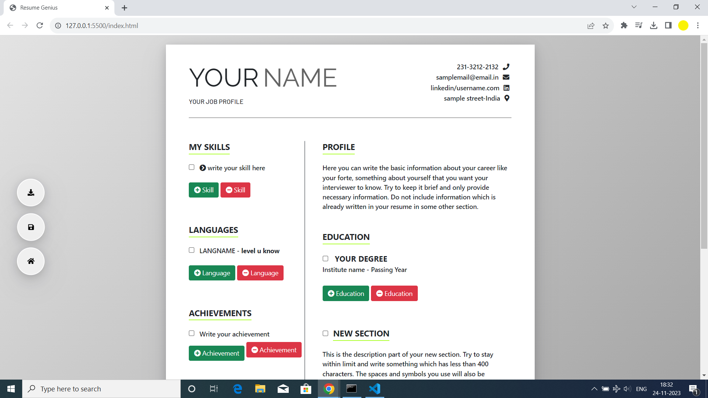
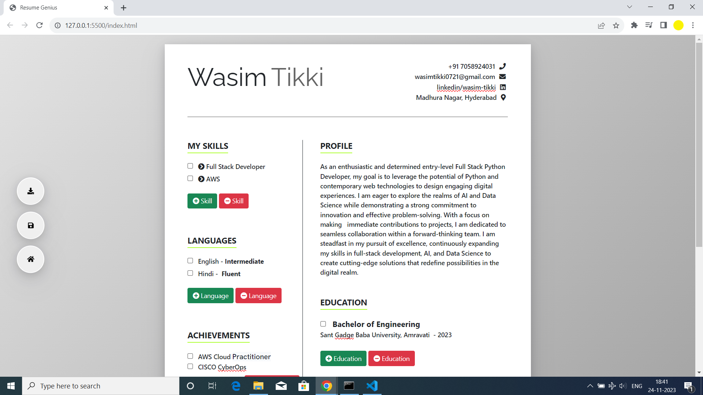
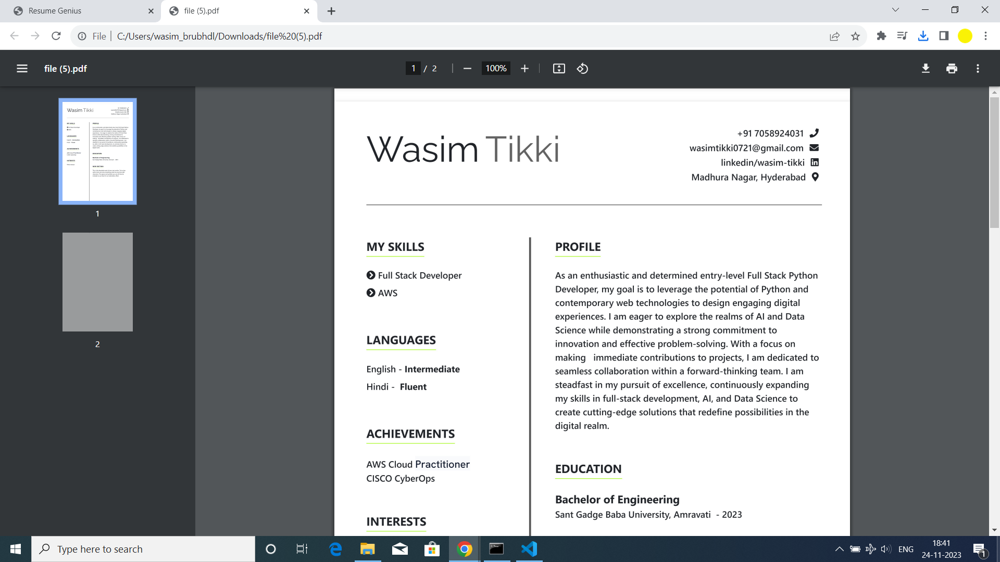

# 🌟 Resume Genius

ResumeGenius is a user-friendly web-based application that allows you to effortlessly create and customize your professional resume or curriculum vitae (CV). Stand out from the crowd and present your skills and experiences in a visually appealing way.

## 🚀 Features

- **Easy to Use:** Create your resume with a simple and intuitive interface.
- **Dynamic Sections:** Add and remove sections such as skills, languages, achievements, interests, and more.
- **Customization:** Tailor your resume to reflect your unique strengths and experiences.
- **Download and Save:** Save your resume as a PDF or store it for future edits.

## 👀 Experience Resume Genius

- **Explore the Resume Genius Demo: [Click Here](https://resume-genius.netlify.app/)** 

## 📸 Screenshots





## 🛠️ Getting Started

1. **Clone the Repository:**

    ```bash
    git clone https://github.com/wasimtikki120/Resume-Genius.git
    ```

2. **Open `index.html` in Your Web Browser.**

3. **Start Building Your Resume!**

## 🌐 Usage

1. **Adding Education:**
   - Click the "Education" section.
   - Use the "Add Education" button to include details about your academic background.

2. **Skills and Languages:**
   - Update your skills and proficiency levels.
   - Add languages you are proficient in.

3. **Achievements and Interests:**
   - Showcase your achievements and interests.

4. **Custom Sections:**
   - Add new sections to highlight unique aspects of your profile.

5. **Download:**
   - Click the download button to save your resume as a PDF.

## 🤝 Contributions

Contributions are welcome! If you have ideas for improvements or new features, feel free to open an issue or submit a pull request [Contribution Guidelines](CONTRIBUTING.md).

## 📄 License

Resume-Genius is licensed under the [MIT License](LICENSE.md).[](https://opensource.org/licenses/MIT)
Feel free to customize and use it in your projects. 

## 🌟 About
ResumeGenius was created with the goal of simplifying the resume building process, making it accessible to everyone. Whether you are a seasoned professional or just starting your career, ResumeGenius provides the tools to create a standout resume.
🚀 **Our Mission:** Empowering individuals to present their professional story with confidence.

## ✨ Author

[Mohammad Wasim Tikki](https://github.com/wasimtikki120)

## ❤️ Support

If you encounter any issues or have suggestions, [open an issue](https://github.com/wasimtikki120/Resume-Genius/issues).

